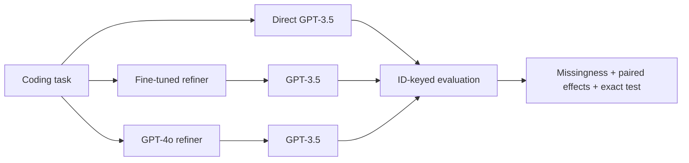

<div align="center">

# Prompt Refinement, Tested

**A reproducible re-analysis of a historical 200-task experiment asking whether prompt refinement improves LLM code generation.**

The honest answer in this historical experiment: **no demonstrated improvement.**

[](https://github.com/Z-MarkUs/Prompt-Refinement-for-AI-Coding-Assistance/actions/workflows/ci.yml)
[](https://z-markus.github.io/Prompt-Refinement-for-AI-Coding-Assistance/)
[](https://www.python.org/)
[](https://mypy-lang.org/)

[Live case study](https://z-markus.github.io/Prompt-Refinement-for-AI-Coding-Assistance/) ·
[Generated results](docs/results.md) ·
[Reproducibility guide](docs/reproducibility.md) ·
[Architecture](docs/architecture.md)

</div>


## The result

Three historical workflows attempted the same coding benchmark: direct generation, a
fine-tuned prompt refiner followed by generation, and a general GPT-4o refiner followed
by generation. The direct route remained strongest.

| Workflow | Published accepted | Published rate | Same 193 tasks |
| --- | ---: | ---: | ---: |
| Direct GPT-3.5 | 134 / 197 | **68.02%** | **131 / 193 (67.88%)** |
| Fine-tuned refiner → GPT-3.5 | 126 / 196 | 64.29% | 124 / 193 (64.25%) |
| GPT-4o refiner → GPT-3.5 | 55 / 199 | 27.64% | 53 / 193 (27.46%) |

The most relevant paired comparison is direct versus the fine-tuned-refiner route. On
194 shared task IDs, direct-only successes were 23 and refiner-only successes were 16.
The difference was **−3.61 percentage points** for refinement, with a two-sided exact
McNemar **p = 0.3368**. That is not evidence of an improvement.

Excluding the three likely task-identity conflicts produces the same conclusion: 191
paired tasks, 22 direct-only versus 16 refiner-only successes, **−3.14 percentage
points**, and **p = 0.4177**. The generated report keeps both the headline history and
this sensitivity analysis visible.



These are archived model labels and historical judge observations, not a current model
leaderboard. See the [generated report](docs/results.md) for all pairwise comparisons,
source hashes, missing-task counts, and limitations.

## Role and contribution

Created and maintained by [Hehan Zhao](https://github.com/Z-MarkUs). I created the
original 2025 experiment repository and directed the 2026 AI-assisted rebuild into an
auditable case study. The work spans experiment framing, raw-evidence preservation,
data-quality rules, ID-paired statistics, typed implementation, test strategy, and public
presentation. Automated changes remain inspectable through source fingerprints,
generated artifacts, and deterministic quality gates that make no model or judge calls.
Text-artifact fingerprints are stable across checkouts: they remove an optional UTF-8
BOM and normalize CRLF or CR newlines to LF before SHA-256, without changing other
content.

## Engineering rebuild

The current repository is a typed, local-first evaluation system around the preserved
historical experiment. Its public engineering surface now provides:

- **Reproducible analysis:** results are joined by task ID; missingness, complete cases,
  discordant wins/losses, effect sizes, and exact McNemar tests are generated from raw
  artifacts.
- **Data-quality audit:** typed CSV/JSONL loaders report malformed signatures, duplicate
  conversations, empty content, likely task-identity conflicts, exact cross-split matches,
  curated semantic overlaps, and stable SHA-256 fingerprints.
- **Secure model boundary:** secrets come from the environment, the optional OpenAI
  adapter uses the Responses API with storage disabled, and the core pipeline accepts an
  injected backend for offline tests.
- **Engineering gates:** Ruff, strict mypy, pytest, branch coverage, dependency auditing,
  multi-version Python CI, and package builds run without paid inference or online-judge
  traffic.
- **Evidence-led presentation:** the responsive static site uses only reproduced metrics
  and makes the negative finding and limitations prominent.
- **Agent-ready workflow:** byte-identical repository skills guide Codex and Claude Code
  through validation, paired analysis, claim auditing, and safe experiment changes,
  following the [Codex](https://developers.openai.com/codex/build-skills) and
  [Claude Code](https://code.claude.com/docs/en/slash-commands) project-skill conventions.

The migration and safety rationale for retired legacy scripts is documented in
[`AutoTest/README.md`](AutoTest/README.md).

## Reproduce it

Requires Python 3.10 or newer.

```bash
git clone https://github.com/Z-MarkUs/Prompt-Refinement-for-AI-Coding-Assistance.git
cd Prompt-Refinement-for-AI-Coding-Assistance

python -m venv .venv
# macOS/Linux: source .venv/bin/activate
# Windows PowerShell: .venv\Scripts\Activate.ps1
python -m pip install --upgrade --constraint constraints/ci.txt pip
python -m pip install --constraint constraints/ci.txt -e ".[dev]"

prompt-refinement-eval report --output docs/results.md --analysis-output results/historical-analysis.json
python -m pytest --cov --cov-report=term-missing
```

`constraints/ci.txt` pins the tested CI and release toolchain; `pyproject.toml` keeps
compatible dependency ranges for package consumers.

The analysis and report commands are deterministic and offline. To inspect their inputs
or supply new arms, start with:

```bash
prompt-refinement-eval analyze --help
prompt-refinement-eval report --help
```

The no-argument arm defaults are a repository-checkout convenience. A wheel installed
elsewhere stays data-neutral and requires at least two explicit `--arm NAME=PATH` inputs.

### Audit the legacy datasets

```bash
prompt-refinement-eval validate --output results/data-validation.json
```

This command intentionally exits with status `1` on the preserved raw data. The benchmark
is structurally valid with six warnings: three repeated signatures and three likely
prompt/signature identity conflicts. The fine-tuning files contain two duplicated training
conversations, one additional repeated training prompt, one empty assistant object, and
one empty validation prompt. A hash-bound review also confirms two equivalent task
variants shared by the retained training export and benchmark (IDs 1009 and 1038). The
repository does not record whether that exact export was bound to the evaluated fine-tuned
model, so this is disclosed as a leakage risk—not asserted as proven contamination.
Excluding both tasks from the direct-versus-fine-tuned comparison leaves 192 pairs, the
same 23 versus 16 discordant successes, and the same exact p = 0.3368 conclusion.

Those failures and warnings are results, not broken tests. The raw exports remain
unchanged; known identity repairs and overlap decisions live in the fingerprinted
[`benchmark_corrections.json`](data/curated/benchmark_corrections.json) and
[`train_benchmark_overlaps.json`](data/curated/train_benchmark_overlaps.json) manifests.
The complete machine-readable audit is committed in
[`data-validation.json`](results/data-validation.json).

## Optional model integration

The historical analysis requires no API key. A new, explicitly authorized model run can
use the provider-neutral pipeline and optional
[OpenAI Responses API](https://developers.openai.com/api/reference/python/resources/responses/methods/create)
adapter:

```bash
python -m pip install -e ".[openai]"
# Set PROMPT_EVAL_RUN_ID, PROMPT_EVAL_GENERATOR_MODEL, and OPENAI_API_KEY.
# Set the refiner model and per-stage controls too when testing a refined arm.
# Never commit populated environment files.
```

```python
from datetime import datetime, timezone

from prompt_refinement_eval.config import ExperimentConfig
from prompt_refinement_eval.pipeline import (
    ExperimentArm,
    PromptEvaluationPipeline,
    RunContext,
)
from prompt_refinement_eval.providers.openai import OpenAIResponsesBackend

config = ExperimentConfig.from_env()
backend = OpenAIResponsesBackend(config.require_api_key())
pipeline = PromptEvaluationPipeline(backend)

result = pipeline.run(
    context=RunContext(
        run_id=config.run_id,
        task_id="example-001",
        provider="openai",
        started_at_utc=datetime.now(timezone.utc).isoformat(),
    ),
    prompt="Return the sum of two integers.",
    function_signature="def add(a: int, b: int) -> int:",
    arm=ExperimentArm(
        arm_id="direct",
        strategy_version="direct-v1",
        generator=config.generator_stage(),
    ),
)
```

No command in CI calls a model or submits code to an online judge. Do not use this project
for live contests or hiring assessments.

## Repository map

```text
src/prompt_refinement_eval/     Typed package, CLI, statistics, and provider adapter
tests/                          Offline unit, integration, truthfulness, and site tests
results/                        Generated validation and historical-analysis evidence
docs/                           Architecture, reproducibility, and generated report
data/curated/                   Fingerprinted correction and overlap manifests
site/                           Dependency-free GitHub Pages case study
.agents/skills/                 Codex repository skill
.claude/skills/                 Byte-identical Claude Code skill
AutoTest/                       Historical benchmark, solutions, and judge artifacts
Model Fine-Tuning/              Historical training and validation exports
```

Third-party problem content and the repository's current licensing boundary are described
in [`THIRD_PARTY_NOTICES.md`](THIRD_PARTY_NOTICES.md).

## Methodological boundaries

- The three published result files contain 197, 196, and 199 observations; the all-arm
  intersection contains 193 tasks.
- The experiment did not repeat generations across random seeds.
- Judge acceptance measures functional correctness for those cases, not maintainability,
  security, latency, or cost.
- Pairwise p-values are descriptive and are not adjusted for multiple comparisons.
- The exact fine-tuned-model/training-export linkage is not recorded; the cross-split
  audit therefore reports risk and sensitivity rather than claiming causal contamination.
- The available records cannot isolate which prompt transformations helped or harmed.

For review standards and contribution steps, see [CONTRIBUTING.md](CONTRIBUTING.md).
Security reports should follow [SECURITY.md](SECURITY.md).
